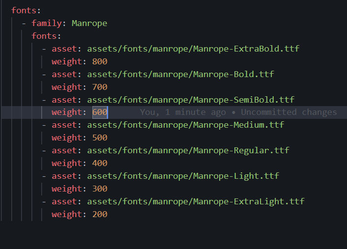
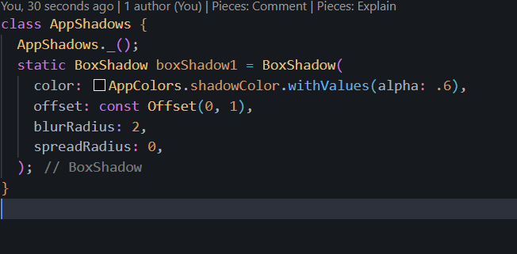
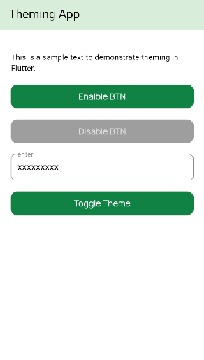
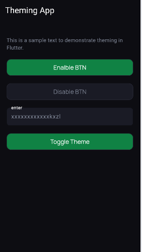

# testing_in_flutter

A new Flutter project.
## 1- adding fonts in pubspec yaml done 

## 2- adding app text style 

## 3- adding app colors and app Shadows 

## 4- adding light mode theme done

## 5- adding dark mode theme done
